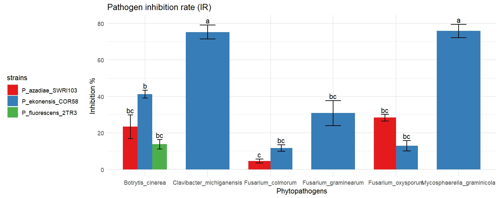

# Interacción entre bacterias _Pseudomonas_ y Patógenos de Viñedos
## Objetivo
Este proyecto está enfocado para el análisis de ensayos antagonistas _in vitro_ entre bacterias beneficiosas _Pseudomonas_ y hongos y bacterias fitopatógenos. El proyecto trata de contribuir a la evaluación del potencial de biocontrol de las bacterias beneficiosas a través del análisis estadístico y genómico. 
## Descripción de especias utilizadas.
### Especies de Bacterias beneficiosas:
1. _Pseudomonas ekonensis_ COR58
2. _Pseudomonas azadiae_ SWRI103
3. _Pseudomonas fluorescens_ 2TR3

### Especies de Bacterias Patógenas:
1. _Mycosphaerella graminicola_
2. _Clavibacter michiganensis_

### Especies de Hongos Patógenos:
1. _Fusarium colmorum_
2. _Fusarium graminearum_
3. _Fusarium oxysporum_
4. _Botrytis cinerea_

## Bases de datos
1. _bacteria.csv_
2. _fungal_test.csv_
   
## Secuencias
1. _Biochemical_test.R_
   
## Analisis estadístico
1. _Antagonist_test_all_IR.R_
2. _Biochemical_test.R_
## Características de nuestro proyecto
- Análisis estadístico que compara la actividad de biocontrol entre varias especies
- Visualización rápida de resultados para saber las bacterias con potencial de control biológico
- Scripts funcionan para la interacción entre especies de hongos y bacterias

## Aplicaciones
- Evaluación de la capacidad de bioncontrol de bacterias _Pseudomonas_
- Evaluación de actividad proteica de las bacterias beneficiosos
- Investigación de sequencias de patógenos de viñedos

## Estructura del Proyecto

Carpetas organizadas por tipo de documentos:
- Análisis estadísticos
- Base de datos
- Secuencias: Se encuentran las secuencias obtenidas del NCBI en formato .fasta para las especies analizadas en este proyecto. 

## Ejemplo de Análisis

